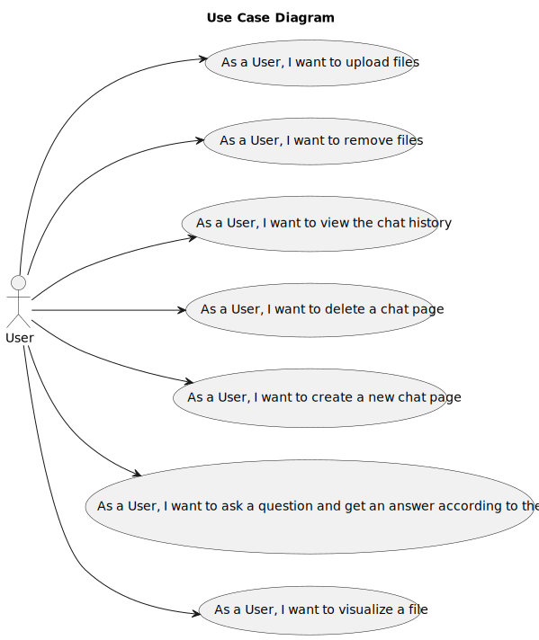
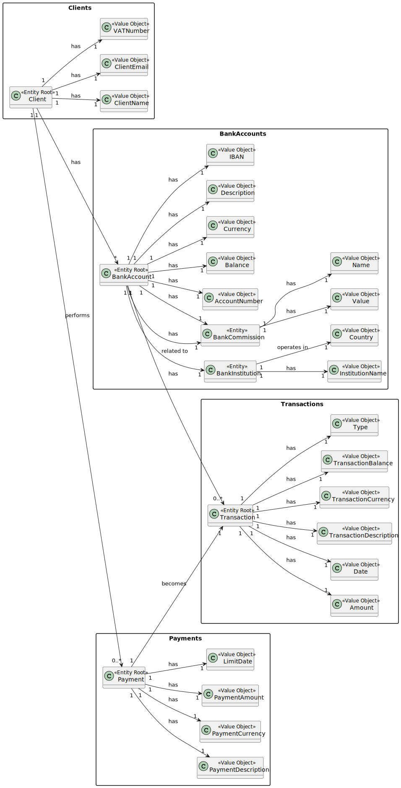

# RAGSystem_Wiki
## Level 1
### Logical View

### Use Case Diagram

## Level 2
### Logical View

### Deployment View

### Implementation View

## Level 3
### Backend Logical View 

### Backend Implementation View 

### Frontend Logical View 

### Frontend Implementation View 

### AI/RAG Logical View

### AI/RAG Implementation View

## Domain Model

## Requirements and Use Cases

| Category                         | Requirement | Use Case (Description) | Acceptance Criteria |
|----------------------------------|------------|------------------------|---------------------|
| **File Treatment**               | UC1        | As a User, I want to add a new file. | The User can add a new file to the chat. |
|                                  | UC2        | As a User, I want to delete a file. | The User can eliminate a file from the chat. |
|                                  | UC3        | As a User, I want to visualize a file. | The User can visualize a file that was previously added to the chat. |
| **Chat Page Treatment**          | UC4        | As a User, I want to create a new chat page. | The User can add a new chat page. |
|                                  | UC5        | As a User, I want to remove a chat page. | The User can remove a chat page. |
|                                  | UC6        | As a User, I want to view the chat history. | The User can view the history of a chat page. |
| **Interactions with the Chat System** | UC7        | As a User, I want to ask a question and get an answer according to the files. | The User can ask a question to the system and receive an answer built accordingly to the files he previously provided. |

---

## Use Cases and Acceptance Criteria

| Use Case | Acceptance Criteria |
|----------|---------------------|
| UC1: As a User, I want to add a new file. | The User can add a new file to the chat. |
| UC2: As a User, I want to delete a file. | The User can eliminate a file from the chat. |
| UC3: As a User, I want to visualize a file. | The User can visualize a file that was previously added to the chat. |
| UC4: As a User, I want to create a new chat page. | The User can add a new chat page. |
| UC5: As a User, I want to remove a chat page. | The User can remove a chat page. |
| UC6: As a User, I want to view the chat history. | The User can view the history of a chat page. |
| UC7: As a User, I want to ask a question and get an answer according to the files. | The User can ask a question to the system and receive an answer built accordingly to the files he previously provided. |
| UC8: : As a User, I want to receive a structured file. | The User can request and receive a structured file.|

---

## Non-Funtional Requirements

### Usability (U)
- Intuitive user interface  
- Complete documentation for the user  

### Reliability (R)
- Service must be available 24/7  
- Fast recovery from fails  
- Consistent maintenance of necessary data  

### Performance (P)
- Fast response time  
- Available to multiple users at the same time  
- Capacity to process large volumes of data  

### Supportability (S)
- Documentation made in a more universal language (English)  
- Development made in a modular way (scalable)  

### Others (+)
- Usage of OpenAI as an external LLM API  
- Usage of MongoDB and Qdrant databases  
- Logic interface made using TypeScript and React framework  
- Business logic made using .NET (C#)  
- Communication with an external API using Python and C#  

---